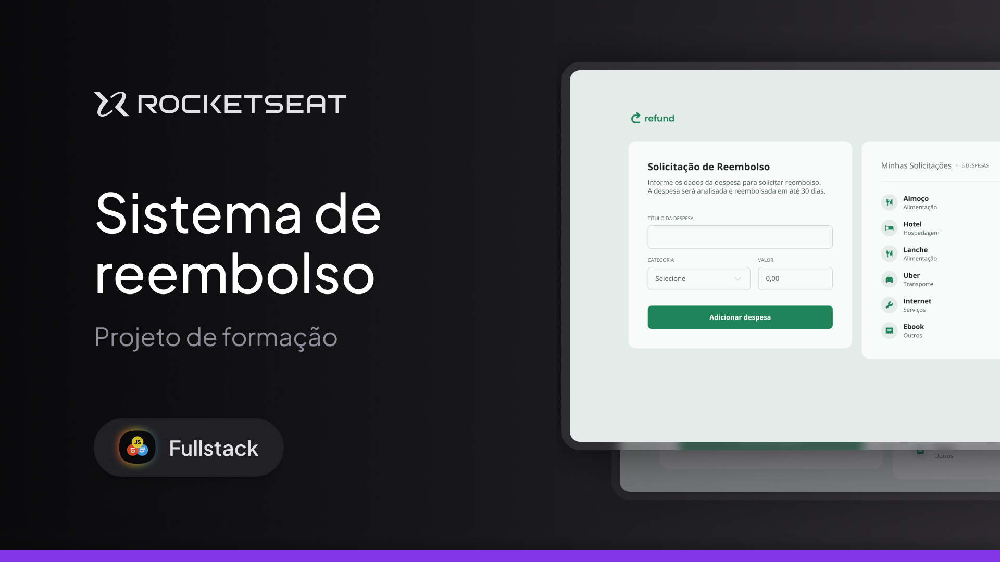

<h1 align="center">Quicklist</h1>

FullStack training programme promoted by Rocketseat!

  

## Overview ⭐

Refund is a web application for requesting reimbursement and listing expenses.

## Technologies used
- HTML e CSS
- JavaScript
- Git e Github
- Figma

## About the development 
By developing this project, I was able to improve my knowledge and skills in the technologies used, with an emphasis on JavaScript.

## Features 💻
- Responsive layout: adapted to various screen sizes.