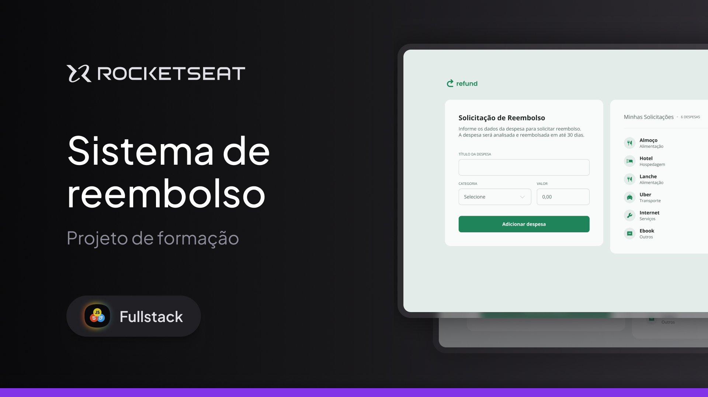

<h1 align="center">Refund</h1>

<p align="center">
FullStack training programme promoted by Rocketseat!</p>

<p align="center">
  
</p>

## Overview ⭐

Refund is a web application for requesting reimbursement and listing expenses.

## Technologies used
- React
- Vite
- JavaScript
- Recoil
- styled-components
- Git e Github
- Figma

## About the development
By developing this project, I was able to improve my knowledge and skills in the technologies used, with an emphasis on React (components, props, state, hooks) and integration with a REST API. It was later extended to apply more advanced React patterns: global state management (first with the Context API, then migrated to Recoil), custom hooks, render memoization, and CSS-in-JS with styled-components.

## Features 💻
- Responsive layout: adapted to various screen sizes.
- Reusable `ExpenseCard` component, receiving the expense data via props.
- Controlled form to add new expenses.
- Mark an expense as **refunded** or **pending** (status button on each card).
- Remove an expense from the list — the remove control is a proper `<button>` with an accessible name, so it also works from the keyboard, not only by mouse click.
- Filter expenses by **all / pending / refunded**.
- Initial expense list loaded through `useEffect`, showing a "Carregando..." message while the request is in flight, while a locally cached copy renders instantly.
- Expenses persisted through a REST API ([crudcrud.com](https://crudcrud.com)); the current list is also mirrored to `localStorage` as an offline-friendly cache. Status updates send the full expense object on `PUT`, since crudcrud replaces the whole record rather than patching individual fields.

## Advanced React concepts applied
- **Global state with Recoil** (`src/atoms/`, `src/selectors/`): `RecoilRoot` wraps the app in `App.jsx`; `expensesAtom` holds the expenses list and `filterAtom` holds the active filter (`all` / `pending` / `refunded`). `filteredExpensesSelector` derives the visible list from those two atoms, and `totalAmountSelector` derives the total amount — both recomputed only when their dependencies actually change, which is Recoil's own memoization. Components read state with `useRecoilValue`/`useRecoilState` (`Home.jsx`, `ExpenseFilters` via props) instead of prop drilling. This replaced the earlier Context API implementation.
- **Custom hook**: `useExpensesActions` (`src/hooks/useExpensesActions.js`) encapsulates the REST calls (`create`/`delete`/`update`) and wires them to the `expensesAtom` setter, keeping `Home.jsx` free of fetch/error-handling logic.
- **Persistence via Recoil atom effect**: `expensesAtom` uses an `effects` function to read/write the expenses list to `localStorage` automatically — the same idea as a `useLocalStorage` custom hook, but implemented as Recoil's own persistence mechanism.
- **Memoization**: `ExpenseCard`, `ExpenseList` and `ExpenseFilters` are wrapped in `React.memo`, and the action functions (`addExpense`, `removeExpense`, `toggleExpenseStatus`) are defined with `useCallback` so their identity stays stable — avoiding unnecessary re-renders of the list when unrelated state changes.
- **CSS-in-JS with styled-components**: styles are defined with `styled-components` template literals, one styled component per visual piece, colocated in the file of the component it belongs to (`App.jsx`, `pages/Home.jsx`, `components/ExpenseForm.jsx`, `components/ExpenseFilters.jsx`, `components/ExpenseCard.jsx`). `src/index.css` was trimmed down to only the font import, CSS reset, `body`/`#root` shell and the typography breakpoint — the rules that are genuinely shared across the whole app, not tied to one component. In `ExpenseCard.jsx`, the status button changes color dynamically based on a boolean prop — `$adicionado` (mapped here to the expense's refunded/pending status): `#198754` (green) when `true`, `#6c757d` (gray) when `false`. In `ExpenseFilters.jsx`, the active filter button is likewise driven by an `$active` boolean prop.

## Project structure
```
src/
  assets/       icons and images
  atoms/        expensesAtom, filterAtom (Recoil global state)
  selectors/    filteredExpensesSelector, totalAmountSelector (derived Recoil state)
  components/   ExpenseCard, ExpenseForm, ExpenseList, ExpenseFilters
  hooks/        useExpensesActions (custom hook)
  data/         expense categories
  pages/        Home
  services/     API integration (crudcrud)
  App.jsx
  main.jsx
```

## Getting started

1. Install dependencies:
   ```bash
   npm install
   ```
2. Copy the environment file and set your own [crudcrud.com](https://crudcrud.com) endpoint (the key expires after a few days, so generate your own):
   ```bash
   cp .env.example .env
   ```
3. Run the project in development mode:
   ```bash
   npm run dev
   ```
